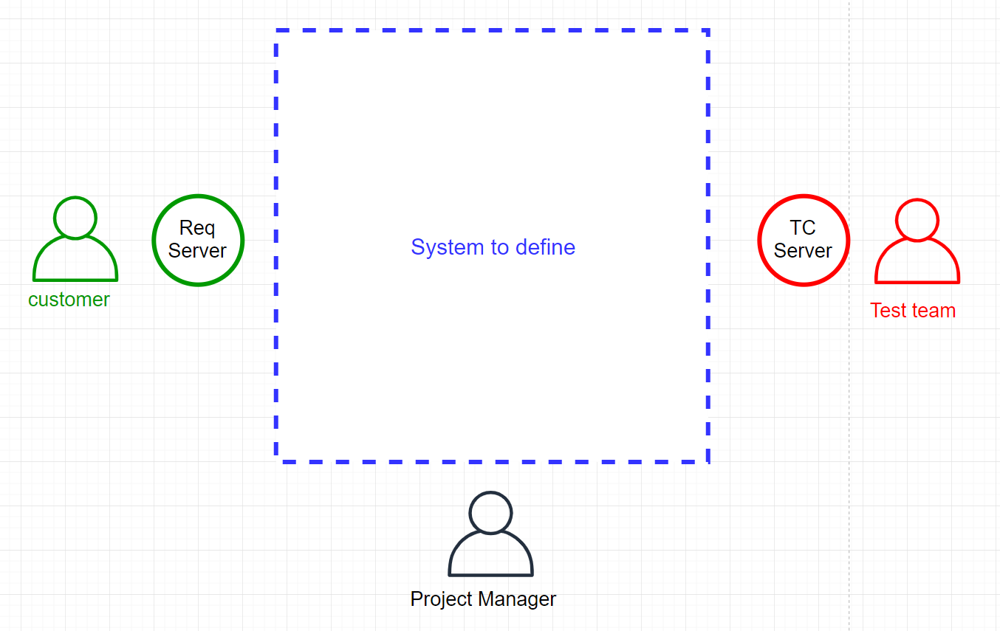

# tooling-technical-test

Advanced Automotive Antennas: Test and Validation exam

> Programming exercise: Write a small program in an OO language such as Python, Java or C# to solve the next questions.

## Question 1
Implement a class FIFO (First in First Out). It should be a class with the
following methods:
- `push`: add an element to the class.
- `pop`: get and remove the oldest element.
- `size`: get the number of elements.
- `addition_time`: get the datetime when any element present on the
FIFO was added. If no position is specified by default return last
element addition.

Made tests that ensures that the class FIFO works as expected.

## Question 2
Implement the following design pattern Factory:


## Question 3

Write a SQL code to get the schedule of a teacher called 'Jonatan'.

Database model:


Expected output:

| Teacher | CourseCode | Day       | Start | End   |
|---------|------------|-----------|-------|-------|
| Jonatan | SQL01      | Monday    | 9:00  | 11:00 |
| Jonatan | DEC55      | Wednesday | 16:00 | 18:00 |
| Jonatan | PYT99      | Friday    | 9:00  | 11:00 |

## Architecture exercise

Define a high-level architecture for a system that fulfill the following needs and
constrains:


- Customer manage the requirements of his new product from their own requirement tool [Req Server].
- A Requirement contains: Requirement id, requirement description, feature that belongs and criticality.
- Our Test team create test cases based on these requirements to ensure that the product accomplish the customer expectations.
- Our Test team manage these test cases from an internal tool [TC Server] because they have "read only" permissions on the customer tool.
- A test case contains test id, test name, test description, test steps, test type and requirement that covers.
- A requirement is covered when it has at least 1 test case associated.
- The Project Manager needs for the system a way to track the requirement coverage by test team.
- The Project manager needs to filter also by requirement feature, requirement criticality and test type.
- The Project Manager needs a tool on the system to generate reports about the test coverage to deliver to the customer.
- [Req Server] and [TC Server] have REST APIs to read any information.
- The time cost to read from [Req Server] is high.

Expected output:

- The system definition should contain the different components that will compose it, such as databases, frontends, APIs, scripts or whatever you consider.
- The main responsibilities of each component should be briefly described.
- How the different components interact between them should be briefly described.
- Any assumption done (for instance if you found something that it is not clear)

**TIP: You can use draws, diagrams or any tool that you consider that could help to explain better. No code or implementation is required.**

## Fundamentals Questions

Q1 – Given the following code, what is the output and the stack?:
```stack = []
stack.push('Element1')
stack.push('Element2')
stack.push(4)
print(stack.pop())
print(stack.pop())
```
- a) Output: Element1, Element2, 4 and None. Stack: Empty
- b) Output: 4 and Element2. Stack: Element1
- c) Output: Element1 and Element2. Stack: 4
- d) Output: 4, Element1, Element2 and None. Stack: Empty

Q2 – What is True about try/catch?
- a. Prevent application crashes due not expected errors.
- b. If no error happens the catch block is never executed.
- c. It is possible to handle custom errors.
- d. All options are true.

Q3 – In inheritance…
- a. … there is no way to override parent properties.
- b. … child objects belong to the parent class.
- c. … child objects cannot use protected parent methods.
- d. … is not a feature of Object-Oriented Programming.

Q4- RESTful API which HTTP methods implements?
- a. GET, PUT, POST and DELETE.
- b. GET and POST.
- c. GET, PUT, POST, DELETE, HEAD and TAIL.
- d. None of above.

Q5 - Which of the following is a non-functional requirement?
- a. The system will enable users to buy books.
- b. The system will allow users to return books.
- c. The system will ensure security of the customer details.
- d. The system will allow up to 100 users to log in at the same time.

Q6 - Which member can never be accessed by inherited classes?
- a. Public member function.
- b. Protected member function.
- c. Private member function.
- d. All can be accessed.

Q7 – Using Git, in the following scenario which actions are needed to integrate local changes in remote branch taking in account that 'commit3' has conflicts with 'commitLocal1'.
- a. pull, merge, push.
- b. stash, pull, stash pop, push.
- c. push.
- d. there is not possible.

Q8 - Which of the following is part of continuous integration?

I. Run unit test.

II. Merge code.

III. Publish changes at production.

IV. Reject changes that have not achieved the quality criteria.

V. Monitor the system.

- a) I and III are true.
- b) I, III and V are true.
- c) I, II, and IV are true.
- d) II, IV and V are true.

Q9 – In Docker, command `docker exec -it container_id bash` is used to:
- a. Build an image.
- b. Access a running container.
- c. Commit changes done in a docker image.
- d. Activate default VM machine.

Q10 – In SQL, how do you select all records from a table named 'Persons' where the value of the column "FirstName" starts with "a"?
- a. SELECT * FROM persons where FirstName='a'
- b. SELECT * FROM persons where FirstName LIKE '%a'
- c. SELECT * FROM persons where FirstName='%a%'
- d. SELECT * FROM persons where FirstName LIKE 'a%'
